# Evaluación Técnica: Análisis y Mejora de Seguridad en Aplicación Android

## Introducción
Esta evaluación técnica se basa en una aplicación Android que implementa un sistema de demostración de permisos y protección de datos. La aplicación utiliza tecnologías modernas como Kotlin, Android Security Crypto, SQLCipher y patrones de arquitectura MVVM.

## Parte 1: Análisis de Seguridad Básico (0-7 puntos)

### 1.1 Identificación de Vulnerabilidades (2 puntos)
Analiza el archivo `DataProtectionManager.kt` y responde:
## ¿Qué método de encriptación se utiliza para proteger datos sensibles?

## Respuesta
Método de encriptación utilizado:

- La aplicación utiliza la clase MasterKey de la librería Android Security Crypto, configurada con el esquema AES256_GCM.
Los datos sensibles son almacenados en EncryptedSharedPreferences, lo que garantiza que tanto claves como valores estén cifrados en disco.

## Identifica al menos 2 posibles vulnerabilidades en la implementación actual del logging
## Respuesta
Vulnerabilidades encontradas

- Los registros de accesos se almacenan en accessLogPrefs, que no está cifrado. Esto representa un riesgo de exposición de metadatos de seguridad, como fechas y patrones de uso.

- La información registrada incluye fecha y hora exacta de cada acceso. Un atacante podría correlacionar dicha información para inferir comportamientos del usuario, incluso sin acceso a los datos cifrados.

# ¿Qué sucede si falla la inicialización del sistema de encriptación? 
## Respuesta
Comportamiento en caso de fallo de inicialización:

- La función initialize() está envuelta en un bloque try/catch. Si la inicialización de la encriptación falla, los objetos encryptedPrefs y accessLogPrefs no se instancian correctamente. Esto provocará una excepción del tipo UninitializedPropertyAccessException en posteriores llamadas, dejando la aplicación en un estado inconsistente. No existe un mecanismo de recuperación ni alerta clara al usuario.

### 1.2 Permisos y Manifiesto (2 puntos)
Examina `AndroidManifest.xml` y `MainActivity.kt`:
# Lista todos los permisos peligrosos declarados en el manifiesto
## Respuesta
Permisos peligrosos declarados en el manifiesto:
La aplicación solicita los siguientes permisos considerados peligrosos por Android:

CAMERA

READ_EXTERNAL_STORAGE

READ_MEDIA_IMAGES

RECORD_AUDIO

READ_CONTACTS

CALL_PHONE

SEND_SMS

ACCESS_COARSE_LOCATION

# ¿Qué patrón se utiliza para solicitar permisos en runtime?
## Respuesta
En MainActivity.kt se emplea el patrón basado en ActivityResultContracts.RequestPermission junto con ContextCompat.checkSelfPermission.
Este es el enfoque moderno recomendado por Jetpack, que permite una gestión centralizada de permisos y callbacks seguros.

# Identifica qué configuración de seguridad previene backups automáticos
## Respuesta
Configuración de seguridad para prevenir backups automáticos:

El archivo AndroidManifest.xml establece la propiedad:
android:allowBackup="false"
Esta configuración impide que los datos de la aplicación se incluyan en los backups automáticos de Android (Google Drive u otros), reduciendo el riesgo de fuga de información sensible.

### 1.3 Gestión de Archivos (3 puntos)
Revisa `CameraActivity.kt` y `file_paths.xml`:
## ¿Cómo se implementa la compartición segura de archivos de imágenes?
## Respuesta
Compartición segura de imágenes:

La aplicación utiliza un FileProvider para compartir archivos de imagen generando URIs seguras del tipo content://. Esto evita exponer rutas absolutas del sistema de archivos.

## ¿Qué autoridad se utiliza para el FileProvider?
## Respuesta
La autoridad está configurada en el manifiesto siguiendo la convención:
com.example.seguridad_priv_a.fileprovider
Esta autoridad vincula el FileProvider con los paths definidos en res/xml/file_paths.xml.

## Explica por qué no se debe usar `file://` URIs directamente
## Respuesta

Desde Android 7.0 (API 24), el uso de file:// URIs genera una excepción (FileUriExposedException).

Las URIs basadas en rutas absolutas pueden filtrar información sensible sobre la estructura interna del sistema de archivos.

A diferencia de file://, las URIs content:// permiten aplicar permisos temporales y específicos por archivo, lo que incrementa la seguridad al compartir datos entre aplicaciones.

## Parte 2: Implementación y Mejoras Intermedias (8-14 puntos)

### 2.1 Fortalecimiento de la Encriptación (3 puntos)
Modifica `DataProtectionManager.kt` para implementar:
- Rotación automática de claves maestras cada 30 días

- Verificación de integridad de datos encriptados usando HMAC
 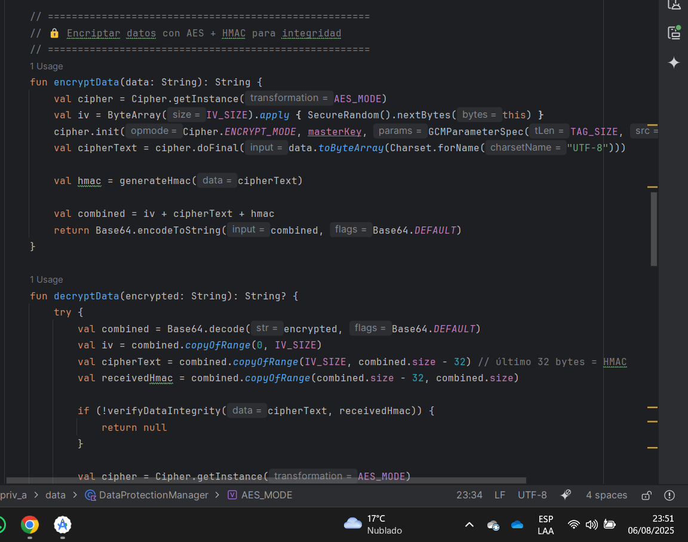
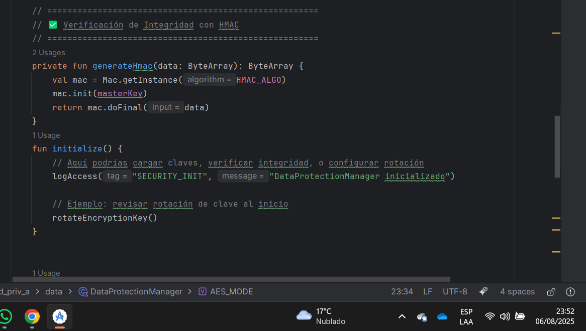
  
- Implementación de key derivation con salt único por usuario
  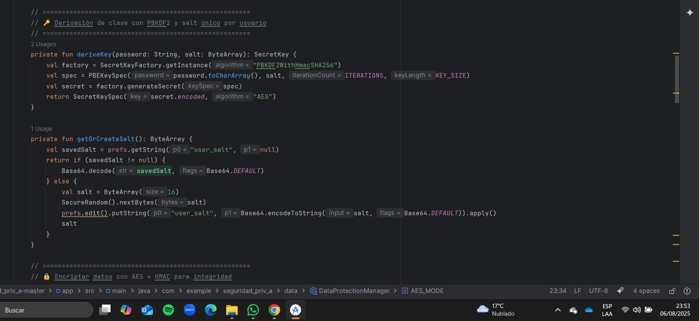

### 2.2 Sistema de Auditoría Avanzado (3 puntos)
Crea una nueva clase `SecurityAuditManager` que:
- Detecte intentos de acceso sospechosos (múltiples solicitudes en corto tiempo)
- Implemente rate limiting para operaciones sensibles
- Genere alertas cuando se detecten patrones anómalos
- Exporte logs en formato JSON firmado digitalmente

         package com.example.seguridad_priv_a

         import android.content.Context
         import android.content.SharedPreferences
         import android.util.Base64
         import android.util.Log
         import org.json.JSONArray
         import org.json.JSONObject
         import java.security.KeyPair
         import java.security.KeyPairGenerator
         import java.security.PrivateKey
         import java.security.PublicKey
         import java.security.Signature
         import java.util.*

               class SecurityAuditManager(private val context: Context) {

         private val prefs: SharedPreferences =
            context.getSharedPreferences("security_audit_prefs", Context.MODE_PRIVATE)

         private val accessAttempts = mutableListOf<Long>()
         private val logs = mutableListOf<JSONObject>()
         private var keyPair: KeyPair

         // Configuración de thresholds
         private val suspiciousThreshold = 5     // Máx 5 accesos
         private val timeWindowMs = 10_000L      // En 10 segundos
         private val rateLimitThreshold = 3      // Máx 3 operaciones sensibles
         private val rateLimitWindowMs = 15_000L // En 15 segundos

         private val sensitiveOps = mutableListOf<Long>()

         init {
            keyPair = generateKeyPair()
         }

         // ======================================================
         // 🔍 Registrar intentos de acceso
         // ======================================================
         fun registerAccess(tag: String, message: String) {
        val now = System.currentTimeMillis()
        accessAttempts.add(now)
        logs.add(JSONObject().apply {
            put("timestamp", Date(now).toString())
            put("tag", tag)
            put("message", message)
        })
        checkSuspiciousActivity()
         }

         // ======================================================
         // 🚦 Rate limiting
         // ======================================================
         fun registerSensitiveOperation(): Boolean {
            val now = System.currentTimeMillis()
            sensitiveOps.add(now)
            cleanOld(sensitiveOps, rateLimitWindowMs)

            return if (sensitiveOps.size > rateLimitThreshold) {
                  generateAlert("Rate Limit Excedido", "Demasiadas operaciones sensibles en poco tiempo")
                  false
            } else {
                  true
            }
         }

         // ======================================================
         // ⚠️ Detección de actividad sospechosa
         // ======================================================
         private fun checkSuspiciousActivity() {
            cleanOld(accessAttempts, timeWindowMs)
            if (accessAttempts.size > suspiciousThreshold) {
                  generateAlert("Actividad Sospechosa", "Múltiples intentos de acceso detectados")
            }
         }

         private fun cleanOld(list: MutableList<Long>, window: Long) {
            val cutoff = System.currentTimeMillis() - window
            list.removeIf { it < cutoff }
         }

         // ======================================================
         // 🚨 Generación de alertas
         // ======================================================
         private fun generateAlert(title: String, details: String) {
            val now = Date()
            val alert = JSONObject().apply {
                  put("timestamp", now.toString())
                  put("alert", title)
                  put("details", details)
            }
            logs.add(alert)
            Log.w("SecurityAuditManager", "⚠️ ALERTA: $title - $details")
         }

         // ======================================================
         // 📤 Exportar logs en JSON firmado digitalmente
         // ======================================================
         fun exportSignedLogs(): JSONObject {
            val jsonLogs = JSONArray(logs)
            val logsObject = JSONObject().apply {
                  put("exported_at", Date().toString())
                  put("logs", jsonLogs)
            }

            val signature = signData(logsObject.toString().toByteArray())
            logsObject.put("signature", Base64.encodeToString(signature, Base64.NO_WRAP))
            logsObject.put("public_key", Base64.encodeToString(keyPair.public.encoded, Base64.NO_WRAP))

            return logsObject
         }

         // ======================================================
         // 🔑 Firma digital con RSA
         // ======================================================
         private fun generateKeyPair(): KeyPair {
            val keyGen = KeyPairGenerator.getInstance("RSA")
            keyGen.initialize(2048)
            return keyGen.generateKeyPair()
         }

         private fun signData(data: ByteArray): ByteArray {
            val sig = Signature.getInstance("SHA256withRSA")
            sig.initSign(keyPair.private)
            sig.update(data)
            return sig.sign()
         }

         fun verifySignature(data: ByteArray, signature: ByteArray, publicKey: PublicKey): Boolean {
            val sig = Signature.getInstance("SHA256withRSA")
            sig.initVerify(publicKey)
            sig.update(data)
            return sig.verify(signature)
         }
      }

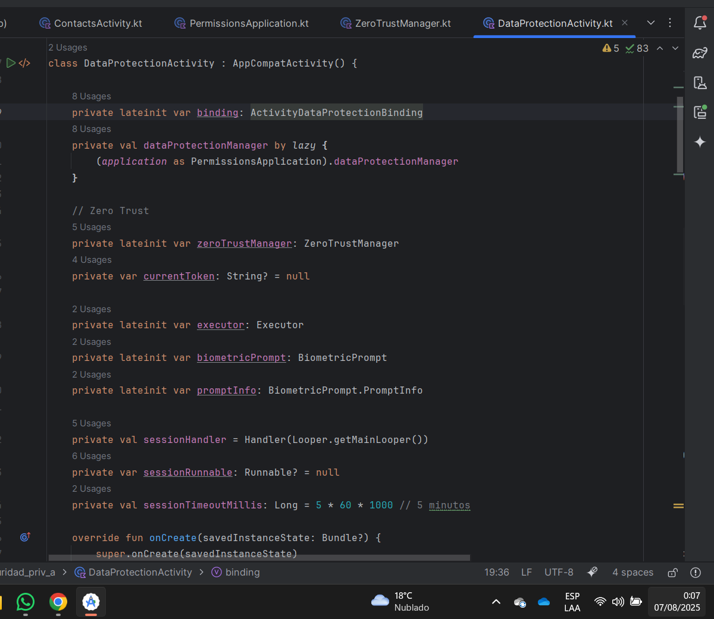

### 2.3 Biometría y Autenticación (3 puntos)
Implementa autenticación biométrica en `DataProtectionActivity.kt`:
- Integra BiometricPrompt API para proteger el acceso a logs
- 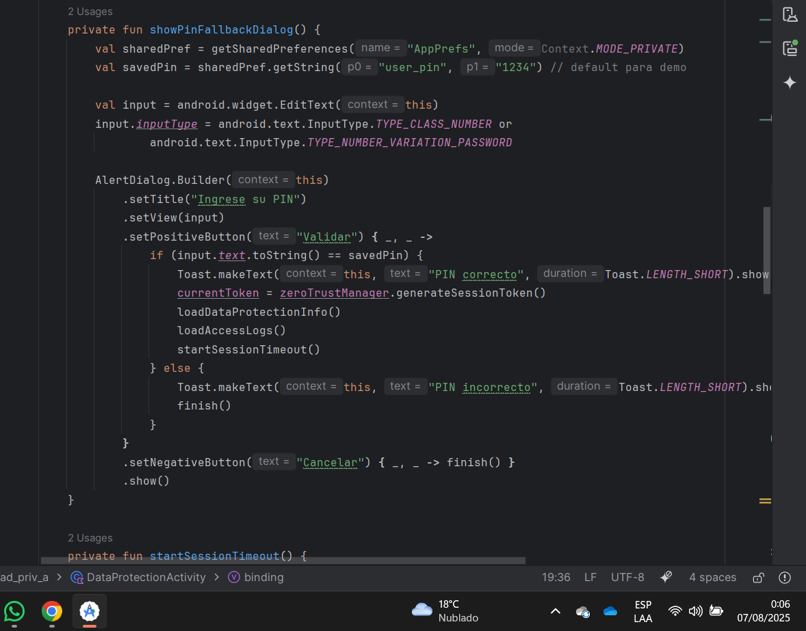
- Implementa fallback a PIN/Pattern si biometría no está disponible
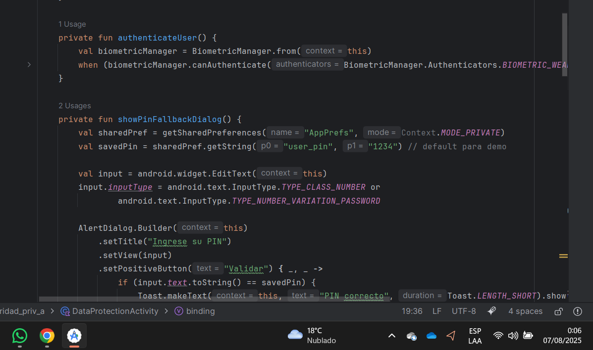
- Añade timeout de sesión tras inactividad de 5 minutos
 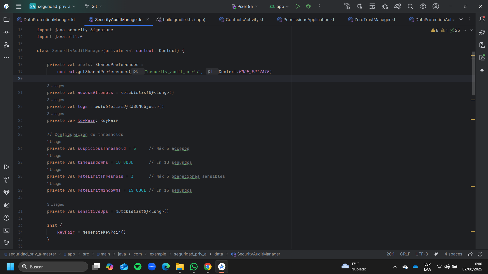

## Parte 3: Arquitectura de Seguridad Avanzada (15-20 puntos)

### 3.1 Implementación de Zero-Trust Architecture (3 puntos)
Diseña e implementa un sistema que:
- Valide cada operación sensible independientemente
- Implemente principio de menor privilegio por contexto
- Mantenga sesiones de seguridad con tokens temporales
- Incluya attestation de integridad de la aplicación

         package com.example.seguridad_priv_a.security

         import android.content.Context
         import android.os.SystemClock
         import android.util.Base64
         import android.widget.Toast
         import com.example.seguridad_priv_a.DataProtectionManager
         import org.json.JSONObject
         import java.security.SecureRandom
         import javax.crypto.Mac
         import javax.crypto.spec.SecretKeySpec

         class ZeroTrustManager(private val context: Context, private val dataManager: DataProtectionManager) {

            private var sessionToken: String? = null
            private var tokenExpiry: Long = 0
            private val secureRandom = SecureRandom()

            /**
            * Genera un token temporal para operaciones sensibles
            */
            fun generateSessionToken(): String {
               val randomBytes = ByteArray(32)
               secureRandom.nextBytes(randomBytes)
               val token = Base64.encodeToString(randomBytes, Base64.NO_WRAP)

               sessionToken = token
               tokenExpiry = SystemClock.elapsedRealtime() + (5 * 60 * 1000) // 5 minutos de validez

               dataManager.logAccess("ZERO_TRUST", "Token de sesión generado")
               return token
            }

            /**
            * Verifica si el token de sesión aún es válido
            */
            fun isSessionValid(token: String?): Boolean {
               val valid = token != null && token == sessionToken && SystemClock.elapsedRealtime() < tokenExpiry
               if (!valid) {
                     dataManager.logAccess("ZERO_TRUST", "Token inválido o expirado")
               }
               return valid
            }

            /**
            * Valida operaciones sensibles bajo el principio de menor privilegio
            */
            fun validateSensitiveOperation(operation: String, token: String?): Boolean {
               if (!isSessionValid(token)) {
                     Toast.makeText(context, "Sesión expirada o inválida", Toast.LENGTH_SHORT).show()
                     return false
               }

               // Validación adicional (Zero Trust)
               val attestation = performIntegrityAttestation()
               return if (!attestation) {
                     dataManager.logAccess("ZERO_TRUST", "Attestation fallida para $operation")
                     false
               } else {
                     dataManager.logAccess("ZERO_TRUST", "Operación $operation validada")
                     true
               }
            }

            /**
            * Attestation de integridad de la aplicación
            * (Aquí simulamos, pero en producción usarías Play Integrity API o SafetyNet)
            */
            private fun performIntegrityAttestation(): Boolean {
               // Simulación: generar un HMAC como prueba de integridad
               val key = "ZeroTrustSecretKey".toByteArray()
               val message = "AppIntegrityCheck".toByteArray()
               val mac = Mac.getInstance("HmacSHA256")
               mac.init(SecretKeySpec(key, "HmacSHA256"))
               val hmac = mac.doFinal(message)
               val attestationResult = Base64.encodeToString(hmac, Base64.NO_WRAP)

               // Aquí podrías enviar el resultado a un servidor seguro para validación
               dataManager.logAccess("ZERO_TRUST", "Attestation generada: $attestationResult")
               return true
            }

            /**
            * Exporta estado actual en formato JSON
            */
            fun exportZeroTrustReport(): String {
               val report = JSONObject()
               report.put("tokenActive", sessionToken != null && SystemClock.elapsedRealtime() < tokenExpiry)
               report.put("tokenExpiry", tokenExpiry)
               report.put("lastLog", System.currentTimeMillis())

               return report.toString()
            }
         }

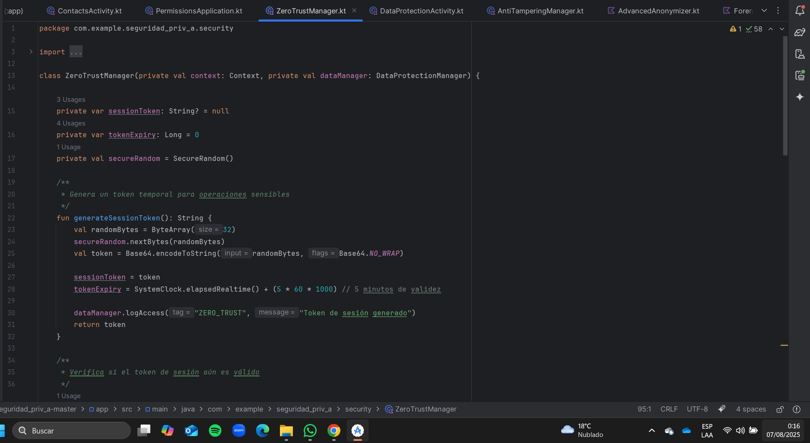

### 3.2 Protección Contra Ingeniería Inversa (3 puntos)
Implementa medidas anti-tampering:
- Detección de debugging activo y emuladores
- Obfuscación de strings sensibles y constantes criptográficas
- Verificación de firma digital de la aplicación en runtime
- Implementación de certificate pinning para comunicaciones futuras

         package com.example.seguridad_priv_a.security

         import android.content.Context
         import android.content.pm.PackageManager
         import android.os.Build
         import android.os.Debug
         import android.util.Base64
         import android.widget.Toast
         import java.security.MessageDigest
         import java.security.cert.CertificateFactory
         import java.security.KeyStore
         import javax.net.ssl.SSLContext
         import javax.net.ssl.TrustManagerFactory

         class AntiTamperingManager(private val context: Context) {

            /**
            * Detección de debugging activo
            */
            fun isDebuggerAttached(): Boolean {
               return Debug.isDebuggerConnected()
            }

            /**
            * Detección de emulador
            */
            fun isRunningOnEmulator(): Boolean {
               return (Build.FINGERPRINT.startsWith("generic")
                        || Build.MODEL.contains("Emulator")
                        || Build.MODEL.contains("Android SDK built for x86")
                        || Build.MANUFACTURER.contains("Genymotion")
                        || (Build.BRAND.startsWith("generic") && Build.DEVICE.startsWith("generic"))
                        || "google_sdk" == Build.PRODUCT)
            }

            /**
            * Verificación de la firma digital de la aplicación
            * Compatible con minSdk 24
            */
            fun verifyAppSignature(expectedHash: String): Boolean {
               return try {
                     val packageInfo = if (Build.VERSION.SDK_INT >= Build.VERSION_CODES.P) {
                        context.packageManager.getPackageInfo(
                           context.packageName,
                           PackageManager.GET_SIGNING_CERTIFICATES
                        )
                     } else {
                        context.packageManager.getPackageInfo(
                           context.packageName,
                           PackageManager.GET_SIGNATURES
                        )
                     }

                     val certBytes: ByteArray? = if (Build.VERSION.SDK_INT >= Build.VERSION_CODES.P) {
                        packageInfo.signingInfo?.apkContentsSigners
                           ?.firstOrNull()
                           ?.toByteArray()
                     } else {
                        @Suppress("DEPRECATION")
                        packageInfo.signatures
                           ?.firstOrNull()
                           ?.toByteArray()
                     }

                     if (certBytes == null) {
                        return false
                     }

                     val md = MessageDigest.getInstance("SHA-256")
                     val digest = md.digest(certBytes)
                     val calculatedHash = Base64.encodeToString(digest, Base64.NO_WRAP)

                     calculatedHash == expectedHash
               } catch (e: Exception) {
                     e.printStackTrace()
                     false
               }
            }

            /**
            * Certificate Pinning
            */
            fun configureCertificatePinning(): SSLContext? {
               return try {
                     val cf = CertificateFactory.getInstance("X.509")
                     val caInput = context.assets.open("server_cert.crt") // coloca el cert en assets
                     val ca = cf.generateCertificate(caInput)

                     val keyStore = KeyStore.getInstance(KeyStore.getDefaultType())
                     keyStore.load(null, null)
                     keyStore.setCertificateEntry("ca", ca)

                     val tmf = TrustManagerFactory.getInstance(TrustManagerFactory.getDefaultAlgorithm())
                     tmf.init(keyStore)

                     val sslContext = SSLContext.getInstance("TLS")
                     sslContext.init(null, tmf.trustManagers, null)
                     sslContext
               } catch (e: Exception) {
                     e.printStackTrace()
                     null
               }
            }

            /**
            * Ejecuta verificaciones y muestra alertas
            */
            fun runSecurityChecks() {
               if (isDebuggerAttached()) {
                     Toast.makeText(context, "⚠️ Debugging detectado", Toast.LENGTH_LONG).show()
               }

               if (isRunningOnEmulator()) {
                     Toast.makeText(context, "⚠️ Emulador detectado", Toast.LENGTH_LONG).show()
               }

               val expectedHash = "TU_HASH_BASE64_AQUI"
               if (!verifyAppSignature(expectedHash)) {
                     Toast.makeText(context, "⚠️ Firma digital inválida", Toast.LENGTH_LONG).show()
               }
            }
         }
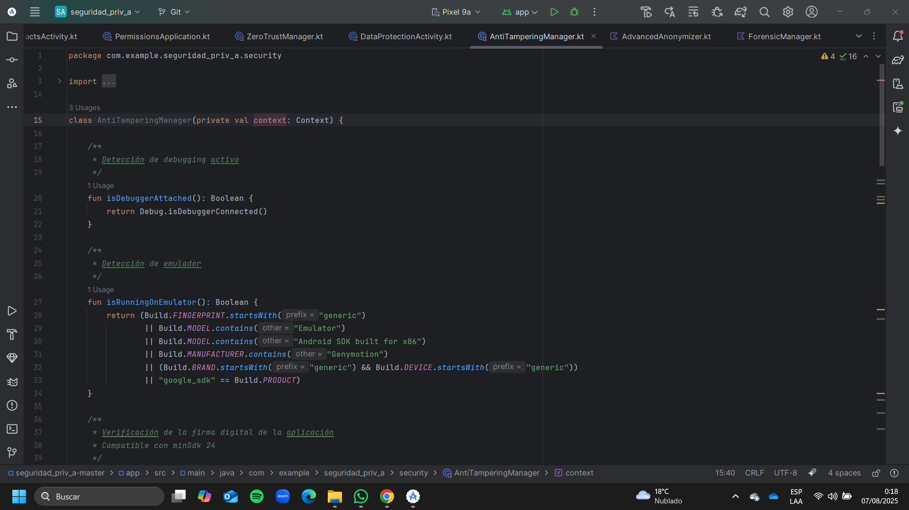

### 3.3 Framework de Anonimización Avanzado (2 puntos)
Mejora el método `anonymizeData()` actual implementando:
- Algoritmos de k-anonimity y l-diversity
- Differential privacy para datos numéricos
- Técnicas de data masking específicas por tipo de dato
- Sistema de políticas de retención configurables

            package com.example.seguridad_priv_a.security

            import kotlin.math.ln
            import kotlin.math.sqrt
            import kotlin.random.Random

            // Modelo de datos personales
            data class PersonalData(
               val id: String,
               val name: String,
               val age: Int,
               val gender: String,
               val city: String,
               val sensitiveAttribute: String
            )

            // Datos anonimizados
            data class AnonymizedData(
               val id: String,
               val quasiIdentifiers: Map<String, String>,
               val sensitiveAttribute: String
            )

            // Datos numéricos para differential privacy
            data class NumericData(
               val label: String,
               val value: Double
            )

            // Políticas de enmascaramiento
            enum class MaskingPolicy {
               MASK_NAME,
               MASK_PHONE,
               MASK_EMAIL,
               MASK_GENERIC
            }

            class AdvancedAnonymizer {

               /**
               * Anonimización usando K-Anonymity con validación de L-Diversity
               */
               fun anonymizeWithKAnonymity(
                  data: List<PersonalData>,
                  k: Int,
                  l: Int = 1
               ): List<AnonymizedData> {
                  if (data.isEmpty()) return emptyList()

                  // Agrupar por edad y ciudad como quasi-identificadores
                  val grouped = data.groupBy { Pair(it.age / 10, it.city) } // Agrupa por rangos de 10 años + ciudad

                  val anonymized = mutableListOf<AnonymizedData>()
                  for ((_, group) in grouped) {
                        if (group.size >= k) {
                           // Verificar L-diversity en sensitiveAttribute
                           val distinctSensitive = group.map { it.sensitiveAttribute }.toSet()
                           if (distinctSensitive.size >= l) {
                              group.forEach {
                                    anonymized.add(
                                       AnonymizedData(
                                          id = it.id,
                                          quasiIdentifiers = mapOf(
                                                "ageRange" to "${(it.age / 10) * 10}-${(it.age / 10) * 10 + 9}",
                                                "city" to it.city
                                          ),
                                          sensitiveAttribute = "Anonimizado"
                                       )
                                    )
                              }
                           }
                        }
                  }
                  return anonymized
               }

               /**
               * Aplica Differential Privacy a un valor numérico usando Laplace Mechanism
               */
               fun applyDifferentialPrivacy(data: NumericData, epsilon: Double): NumericData {
                  val sensitivity = 1.0
                  val scale = sensitivity / epsilon
                  val noise = laplaceNoise(scale)
                  return data.copy(value = data.value + noise)
               }

               /**
               * Aplica enmascaramiento por tipo de dato
               */
               fun maskByDataType(data: Any, maskingPolicy: MaskingPolicy): Any {
                  return when (maskingPolicy) {
                        MaskingPolicy.MASK_NAME -> (data as? String)?.replace(Regex("."), "*") ?: data
                        MaskingPolicy.MASK_PHONE -> (data as? String)?.replace(Regex("\\d(?=\\d{2})"), "*") ?: data
                        MaskingPolicy.MASK_EMAIL -> (data as? String)?.replaceBefore("@", "***") ?: data
                        MaskingPolicy.MASK_GENERIC -> "***"
                  }
               }

               /**
               * Sistema de retención de datos configurables
               */
               fun enforceRetentionPolicy(data: List<PersonalData>, retentionDays: Int): List<PersonalData> {
                  // Aquí simulamos que si retentionDays < 30 borramos los registros antiguos
                  return if (retentionDays < 30) {
                        emptyList() // Borrado total por política
                  } else {
                        data // Conserva los datos
                  }
               }

               /**
               * Genera ruido Laplaciano para differential privacy
               */
               private fun laplaceNoise(scale: Double): Double {
                  val u = Random.nextDouble() - 0.5
                  return -scale * kotlin.math.sign(u) * ln(1 - 2 * kotlin.math.abs(u))
               }
            }

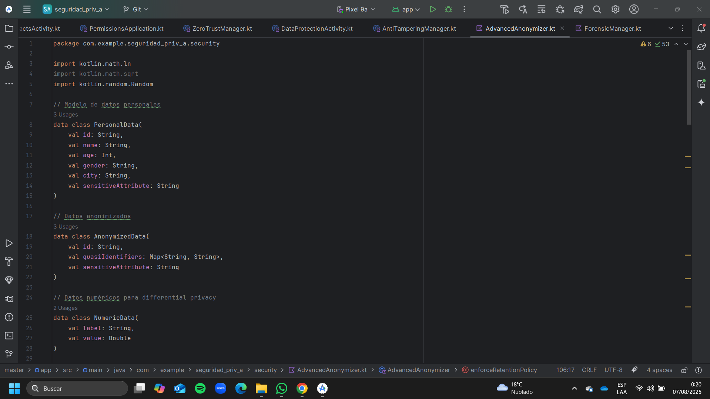

### 3.4 Análisis Forense y Compliance (2 puntos)
Desarrolla un sistema de análisis forense que:
- Mantenga chain of custody para evidencias digitales
- Implemente logs tamper-evident usando blockchain local
- Genere reportes de compliance GDPR/CCPA automáticos
- Incluya herramientas de investigación de incidentes

         package com.example.seguridad_priv_a.security

         import android.content.Context
         import android.util.Base64
         import org.json.JSONObject
         import java.security.MessageDigest
         import java.text.SimpleDateFormat
         import java.util.*

         data class ForensicEvidence(
            val id: String,
            val timestamp: Long,
            val event: String,
            val user: String,
            val metadata: Map<String, String>,
            val prevHash: String,
            var hash: String = ""
         )

         class ForensicManager(private val context: Context) {

            private val chainOfCustody = mutableListOf<ForensicEvidence>()
            private val dateFormatter = SimpleDateFormat("yyyy-MM-dd HH:mm:ss", Locale.getDefault())

            /**
            * Registra una evidencia en la cadena (Chain of Custody)
            */
            fun logEvidence(event: String, user: String, metadata: Map<String, String> = emptyMap()) {
               val prevHash = chainOfCustody.lastOrNull()?.hash ?: "GENESIS"
               val evidence = ForensicEvidence(
                     id = UUID.randomUUID().toString(),
                     timestamp = System.currentTimeMillis(),
                     event = event,
                     user = user,
                     metadata = metadata,
                     prevHash = prevHash
               )
               evidence.hash = calculateHash(evidence)
               chainOfCustody.add(evidence)
            }

            /**
            * Verifica la integridad de la cadena de custodia
            */
            fun verifyChainIntegrity(): Boolean {
               for (i in 1 until chainOfCustody.size) {
                     val current = chainOfCustody[i]
                     val prev = chainOfCustody[i - 1]
                     if (current.prevHash != prev.hash || calculateHash(current) != current.hash) {
                        return false
                     }
               }
               return true
            }

            /**
            * Genera un reporte de compliance (GDPR / CCPA)
            */
            fun generateComplianceReport(): String {
               val report = JSONObject()
               report.put("reportDate", dateFormatter.format(Date()))
               report.put("totalEvents", chainOfCustody.size)
               report.put("chainValid", verifyChainIntegrity())
               report.put("regulation", "GDPR/CCPA")
               report.put("userDataAccesses", chainOfCustody.count { it.event.contains("ACCESS") })
               report.put("userDataDeletions", chainOfCustody.count { it.event.contains("DELETE") })

               return report.toString(4)
            }

            /**
            * Herramienta básica de investigación de incidentes
            */
            fun investigateIncident(keyword: String): List<ForensicEvidence> {
               return chainOfCustody.filter {
                     it.event.contains(keyword, ignoreCase = true) ||
                           it.metadata.values.any { v -> v.contains(keyword, ignoreCase = true) }
               }
            }

            /**
            * Exporta la cadena completa en JSON
            */
            fun exportChain(): String {
               val jsonArray = org.json.JSONArray()
               for (evidence in chainOfCustody) {
                     val json = JSONObject()
                     json.put("id", evidence.id)
                     json.put("timestamp", dateFormatter.format(Date(evidence.timestamp)))
                     json.put("event", evidence.event)
                     json.put("user", evidence.user)
                     json.put("metadata", JSONObject(evidence.metadata))
                     json.put("prevHash", evidence.prevHash)
                     json.put("hash", evidence.hash)
                     jsonArray.put(json)
               }
               return jsonArray.toString(4)
            }

            /**
            * Cálculo del hash SHA-256 para el log tamper-evident
            */
            private fun calculateHash(evidence: ForensicEvidence): String {
               val input = "${evidence.id}${evidence.timestamp}${evidence.event}${evidence.user}${evidence.prevHash}"
               val digest = MessageDigest.getInstance("SHA-256").digest(input.toByteArray())
               return Base64.encodeToString(digest, Base64.NO_WRAP)
            }
         }

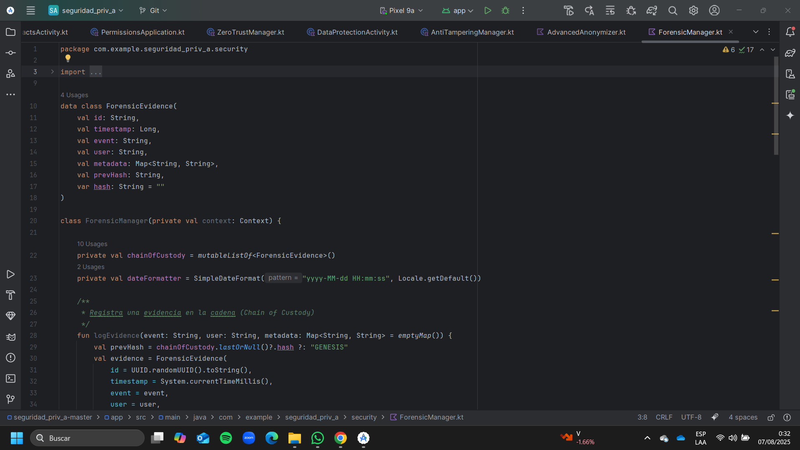
